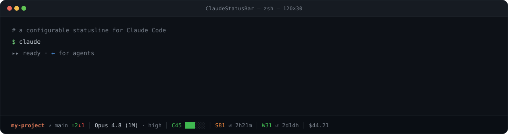

<h1 align="center">ClaudeStatusBar</h1>

<p align="center">
  A lightweight, zero-config statusline for Claude Code.
</p>

<p align="center">
  <a href="LICENSE">
    
  </a>
</p>

> **Personal fork** of [ctxline-claude](https://github.com/MithunWijayasiri/ctxline-claude) by
> [Mithun Wijayasiri](https://github.com/MithunWijayasiri) — MIT licensed, original notice preserved
> in [LICENSE](LICENSE). Customised for my own setup and **not published to npm**; install from
> source. Upstream fixes get merged in periodically, and generic fixes go back upstream as PRs.

<p align="center">
  
</p>

<p align="center">
  Monitor context usage, session limits, and weekly allowance without leaving Claude Code.
</p>

See your **current directory**, **active model**, **context window usage**, and **Claude usage limits** at a glance — including both your **current 5-hour session** and **weekly allowance**.

## Contents

- [Install](#install)
- [Uninstall](#uninstall)
- [What it shows](#what-it-shows)
- [Configuration](#configuration)
- [How it works](#how-it-works)
- [FAQ](#faq)

## Install

```bash
git clone https://github.com/szolcek/ClaudeStatusBar.git
cd ClaudeStatusBar
./install.sh      # macOS / Linux
./install.ps1     # Windows (PowerShell)
```

Then restart Claude Code or start a new session.

<details>
<summary>Live-edit install (recommended when hacking on it)</summary>

Point `~/.claude/settings.json` straight at your working copy so edits take effect on the next
statusline render — no reinstall step:

```json
{
  "statusLine": {
    "type": "command",
    "command": "node /Users/szolcek/Desktop/ClaudeStatusBar/statusline.js"
  }
}
```

</details>

<details>
<summary>Manual install (copy the script)</summary>

```bash
curl -o ~/.claude/hooks/statusline.js https://raw.githubusercontent.com/szolcek/ClaudeStatusBar/main/statusline.js
chmod +x ~/.claude/hooks/statusline.js
```

```json
{
  "statusLine": {
    "type": "command",
    "command": "node ~/.claude/hooks/statusline.js"
  }
}
```

</details>

## Update

```bash
git pull                        # your fork
git fetch upstream && git merge upstream/main    # upstream fixes
./install.sh
```

Restart Claude Code or start a new session for the update to take effect. (Not needed with the
live-edit install above.)

## Uninstall

```bash
node bin/install.js uninstall
```

Removes the `statusLine` entry from `settings.json` (backed up first, other settings untouched), deletes the hook script, and clears the usage cache. If `settings.json` points at a different statusline, it's left alone.

<details>
<summary>Manual uninstall</summary>

Undo the two things the installer did — remove the `statusLine` block from `~/.claude/settings.json` (a timestamped `settings.json.backup.<n>` exists if you'd rather restore), then delete the script:

```bash
# macOS / Linux
rm ~/.claude/hooks/statusline.js
rm -f ~/.claude/cache/usage-cache.json   # optional: clears cached usage
```

```powershell
# Windows (PowerShell)
Remove-Item "$env:USERPROFILE\.claude\hooks\statusline.js"
Remove-Item "$env:USERPROFILE\.claude\cache\usage-cache.json" -ErrorAction SilentlyContinue
```

</details>

## What it shows

| Segment | Detail |
|---|---|
| **Directory** | Current working directory |
| **Branch** | Active git branch, with `↑N↓M` commits ahead / behind your upstream when it diverges |
| **Model** | Active Claude model (Opus / Sonnet / Haiku) |
| **Context** | Visual bar of context-window usage |
| **Current** | Live 5-hour session limit + reset countdown (subscription users) |
| **Weekly** | Weekly usage allowance + time until the weekly reset (subscription users) |
| **Model limit** | Weekly limit scoped to a single model, when your account has one — labelled by the model's initial (`F` = Fable) |
| **Cost** | Running session cost in USD (e.g. `$0.42`) |
| **Task** | The in-progress todo, when there is one |

> [!NOTE]
> Usage bars change color automatically as you approach your limits.

> [!NOTE]
> **Responsive.** On a narrow terminal the line wraps to two — directory, model, and context on the first line; usage, cost, and task on the second. Wide terminals stay on a single line. The break point is configurable (`wrapAfter`). (Auto-sizing needs Claude Code v2.1.153+.)

> [!TIP]
> Don't want every segment? Hide, reorder, or relabel any of them — see [Configuration](#configuration).

## Configuration

The statusline is zero-config by default — everything below is optional.

### Config file — `~/.claude/ctxline.json`

Create it to customise labels, segment order, colors, and the separator. Every key is
optional, and the file is only read if it exists. Set `CTXLINE_CONFIG` to use a different path.

```jsonc
{
  // Bar labels. 1–4 printable characters each.
  "labels": { "session": "S", "weekly": "W", "context": "C" },

  // Relabel a model-scoped bar by model name (case-insensitive).
  // Default is the model's initial, so "Fable" -> F.
  "modelLabels": { "Fable": "f" },

  // Which segments render, and in what order. Omit one to hide it.
  // `dir` includes the git branch; `model` includes the effort suffix;
  // `scoped` covers every model-scoped weekly limit.
  "order": ["dir", "model", "context", "session", "weekly", "scoped", "cost", "task"],

  // On a narrow terminal the line breaks after this segment. null = never wrap.
  "wrapAfter": "context",

  // Drop the context size from the model name: "Opus 5 (1M)" -> "Opus 5".
  // Only a size is stripped; any other parenthetical is left alone.
  "hideContextSize": false,

  // Shed detail as the terminal narrows, instead of wrapping straight away.
  "compact": false,

  // Hide a model-scoped countdown when it reads the same as the weekly one.
  "dedupeResets": false,

  // Columns to hold back from COLUMNS. The host draws the statusline inside its
  // own padding, so the usable width is smaller than the terminal width; without
  // this the line measures as fitting and then gets clipped with an ellipsis.
  "widthMargin": 0,

  "separator": " │ ",

  // Usage bar colors: green below the first, then yellow, orange, red.
  "thresholds": [50, 75, 90]
}
```

Comments aren't valid JSON — they're shown here for clarity only.

**Failure behaviour.** A config mistake can't break the statusline. An unreadable or
malformed file is ignored entirely, and each key is validated on its own: one bad value
falls back to its own default while the rest of the file still applies. An `order`
containing only unknown names falls back to the full default rather than rendering a blank
line, and control characters are rejected in labels and separators so a config file can't
inject terminal escapes.

**Compact mode.** With `"compact": true` the line sheds detail progressively as the
terminal narrows, and only wraps once there's nothing left to shed:

| Level | Drops |
|---|---|
| 0 | nothing — full detail |
| 1 | the context bar glyphs (the `C38` number stays) |
| 2 | the `↺ 2d13h` reset countdowns |
| 3 | the effort suffix; model name truncated to 10 characters |

```
120 cols  Opus 5 · high │ C38 ██░░░░ │ S49 ↺ 1h59m │ W63 ↺ 2d13h │ F88 ↺ 2d13h
 64 cols  Opus 5 · high │ C38 │ S49 ↺ 1h59m │ W63 ↺ 2d13h │ F88 ↺ 2d13h
 44 cols  Opus 5 · high │ C38 │ S49 │ W63 │ F88
 34 cols  Opus 5 │ C38 │ S49 │ W63 │ F88
 26 cols  Opus 5 │ C38
          S49 │ W63 │ F88
```

Percentages are never dropped — they're the reason the bar exists. If the width isn't
known (no `COLUMNS`), nothing is abbreviated, since there's nothing to measure against.

Two things worth knowing: `wrapAfter` must name a segment that's present in `order`,
otherwise there's nowhere to break and the line never wraps. And changes take effect on the
next render — no restart needed.

### Hiding segments — `CTXLINE_DISABLE`

To **hide segments** without writing a config file, set the `CTXLINE_DISABLE` environment variable to a comma-separated list of any of:

`branch` · `effort` · `cost` · `task` · `usage` (5-hour + weekly + model-scoped)

Unknown names are ignored. The example below hides cost and the current task. (`order` in the config file can hide any segment, including directory, model, and context.)

#### Option A — `settings.json` (recommended)

Works on every OS and survives restarts. Add a top-level `env` block to `~/.claude/settings.json` — Claude Code passes it to every command it spawns, including the statusline:

```json
{
  "env": {
    "CTXLINE_DISABLE": "cost,task"
  },
  "statusLine": {
    "type": "command",
    "command": "node ~/.claude/hooks/statusline.js"
  }
}
```

Restart Claude Code (or start a new session) to apply.

#### Option B — shell environment

Set the variable **before** launching `claude` (the statusline inherits Claude Code's environment):

```bash
# macOS / Linux
export CTXLINE_DISABLE="cost,task"
claude
```

```powershell
# Windows (PowerShell) — this terminal only
$env:CTXLINE_DISABLE = "cost,task"; claude

# Windows — persist for future sessions (then open a NEW terminal)
setx CTXLINE_DISABLE "cost,task"
```

To re-enable a segment, remove it from the list (or delete the variable) and restart Claude Code.

## How it works

- **Source** — context comes from Claude Code's session data. The 5-hour and weekly bars are read straight from the `rate_limits` field Claude Code pipes in (no network), falling back to `https://api.anthropic.com/api/oauth/usage` when that field isn't present yet. API-key users skip usage entirely.
- **Model-scoped limits** — `rate_limits` carries only `five_hour` and `seven_day`, so a model-scoped weekly limit can only come from `/usage` (its `limits` array). It's served from the same cache as everything else, so this costs at most one call per 30s no matter how often the line renders.
- **No network on the fast path** — when `rate_limits` is in the session data, there's no API call at all. The fetch below only runs as a fallback (e.g. the first render of a session, before the field appears).
- **Adaptive timing** — for the fallback fetch: 1.5s timeout on the first prompt (cold start), 1.2s after (connection reused).
- **Caching** — the fallback fetch is cached at `~/.claude/cache/usage-cache.json`, shared across sessions. Within 30s the cache renders directly (the API call is skipped); if a live call fails, the last value (up to 10 min old) is shown so the bar never vanishes. The reset countdown recomputes every render.
- **Backoff** — a failed usage fetch is remembered (`~/.claude/cache/usage-backoff.json`): 1 minute for a timeout or transient error, 5 minutes for an HTTP 429. During a backoff no request is made and the last cached value is shown even past its normal expiry. Without this a missing cache means every render retries, and a rate-limited endpoint stays rate-limited because the retries are themselves the load.
- **Never breaks** — every failure path falls back silently; the statusline always prints.

## FAQ

<details>
<summary>Does it use extra tokens?</summary>

No — zero tokens, ever. The statusline is part of Claude Code's UI; its output is drawn in your terminal and is **never sent to the model**. Nothing it shows (context, usage, cost, git status) enters the conversation or counts toward your context window.

</details>

<details>
<summary>Does fetching data slow down Claude Code?</summary>

No, it's imperceptible. Almost every render reads a small local cache (sub-millisecond) instead of fetching. The usage API only runs as a fallback (and is cached); the git ahead/behind check runs at most once every ~5s and is hard-capped so it can never hang. The statusline runs as its own background command, so it never blocks your typing or Claude's responses — and in a non-git folder the git check doesn't run at all.

</details>

<details>
<summary>Does this use the same data as /usage?</summary>

Yes — the same 5-hour and weekly limits. It reads them from the session data Claude Code provides when available, and falls back to Anthropic's usage API (the endpoint `/usage` uses) otherwise.

</details>

<details>
<summary>Is the session cost my actual bill?</summary>

It's the cost Claude Code computes for the session (tokens × per-model API pricing), read straight from the session data. For subscription (Pro/Max) users it's the *equivalent* pay-as-you-go API cost — useful as a gauge of session weight, but not what you're billed (you pay the flat subscription). It's an estimate, accurate to the extent your Claude Code pricing tables are current.

</details>

<details>
<summary>Does it work with API keys?</summary>

Yes. The statusline automatically detects subscription vs API-key usage.

</details>

<details>
<summary>Can it break Claude Code?</summary>

No. [Statuslines are a built-in Claude Code feature](https://code.claude.com/docs/en/statusline) — this provides the command Claude Code runs. All failures are handled silently and the statusline always renders.

</details>

<details>
<summary>Does it expose my API keys / auth tokens?</summary>

No. Your credentials never leave your machine. On the fast path no token is read at all — usage comes straight from the session data. Only on the fallback fetch is the OAuth token read locally (from `~/.claude/.credentials.json` or the macOS keychain), used solely to authenticate the request to Anthropic's own usage API — the same endpoint `/usage` uses. Nothing is sent to any third party, logged, or cached; only the resulting usage percentages are stored locally.

</details>

## License

MIT

## Credits

Thanks to [@TahaSabir0](https://github.com/TahaSabir0) for the base config.
